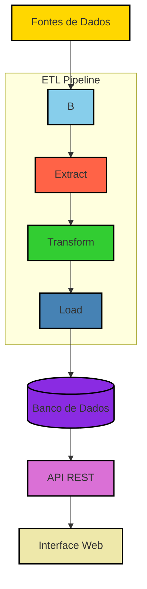

# 💰 Calculadora de Rentabilidade Financeira

Projeto técnico completo com ETL, banco de dados, API e interface web com deploy via Docker e Astronomer.

---

## 🔁 Processo ETL



---

## ⚙️ Tecnologias Utilizadas

| Componente   | Tecnologia         |
|--------------|--------------------|
| Orquestração | Apache Airflow + Astronomer |
| Transformações | dbt               |
| Armazenamento | PostgreSQL         |
| Backend API  | FastAPI             |
| Frontend     | Streamlit           |
| Containerização | Docker + Compose |

- Instale o **Docker**: https://www.docker.com/products/docker-desktop
- Instale o **Astronomer CLI**: https://docs.astronomer.io/astro/cli/install-cli

---

## 🚀 Como Executar o Projeto

### 1. Build dos serviços FastAPI e Streamlit

```bash
docker compose -f docker-compose.override.yml build
```

### 2. Inicialização do ambiente Astronomer

```bash
astro dev init
```

### 3. Atualize o arquivo `.env` com as variáveis de ambiente. Como padrão:

```env
POSTGRES_USER=postgres
POSTGRES_PASSWORD=postgres
POSTGRES_HOST=postgres
POSTGRES_PORT=5432
POSTGRES_DB=icatu_db
POSTGRES_SCHEMA=financial_s
ASTRO_NETWORK=pyicatu_52b355_airflow
```

### 4. Suba os serviços

```bash
astro dev start
```

### 5. Acesse o Airflow

Abra [http://localhost:8080](http://localhost:8080) e:

- Inicie a DAG `financial_data_initialization` para carregar os dados iniciais
- Ative a DAG `daily_financial_data_update` para atualização incremental diária

---

## 🧱 Estrutura do Projeto

```plaintext
├── .astro/                    # Configuração do Astronomer
├── api_icatu/                 # API em FastAPI
│   └── app/
├── dashboard/                 # Aplicação Streamlit
├── dags/                      # DAGs do Airflow
├── datawarehouse/             # Modelos dbt
├── docs/                      # Documentação (opcional)
├── include/, logs/, plugins/  # Diretórios padrão do Airflow
├── pyicatu/                   # Lógica de cálculo financeiro
├── tests/                     # Testes automatizados
├── docker-compose.override.yml
├── Dockerfile
├── .env
├── requirements.txt
├── pyproject.toml / poetry.lock
└── README.md
```

---


## 🔗 Acesse o Streamlit

Abra [http://localhost:8501](http://localhost:8501) para utilizar a interface web.

## 6. Acesse as interfaces

- [Airflow](http://localhost:8080)
- [FastAPI](http://localhost:8001)
- [Teste de conexão com o banco](http://localhost:8001/ping-db)
- [Streamlit](http://localhost:8501)

---

## ✅ Sobre o Teste Técnico

Este projeto foi desenvolvido como solução para o teste técnico **Calculadora de Rentabilidade Acumulada** com os seguintes objetivos:

### 📌 Objetivo Geral

- Automatizar o ETL com dados históricos de CDI e Ibovespa
- Criar uma API com cálculo de rentabilidade acumulada e CRUD de ativos sintéticos
- Criar uma interface web para visualização em tabela e gráfico

### 📌 Requisitos Técnicos Atendidos

- **ETL com Airflow**: coleta, transformação e carga automatizada dos dados
- **DBT**: estruturação dos dados em modelo dimensional
- **PostgreSQL**: banco relacional para armazenamento
- **FastAPI**: API com endpoints para rentabilidade e CRUD
- **Streamlit**: interface web moderna e responsiva
- **Docker e Astronomer**: para containerização e orquestração

### ✅ Funcionalidades

- Atualização incremental diária dos dados (DAG `daily_financial_data_update`)
- Interface com CRUD de ativos, seleção de índice e cálculo de rentabilidade
- Retorno em tabela formatada + gráfico de linha interativo com Plotly
- Testes e documentação incluídos

---
    
## 📈 Sobre o Streamlit


A interface permite:

- Criar, editar e excluir ativos sintéticos como "CDI +2%"
- Selecionar ativos ou índices (CDI, Ibovespa)
- Escolher período de análise
- Visualizar:
  - Rentabilidade acumulada em gráfico (Plotly)
  - Rentabilidade mês a mês em tabela
- Exportar os dados para CSV

---

## 📎 Licença

MIT